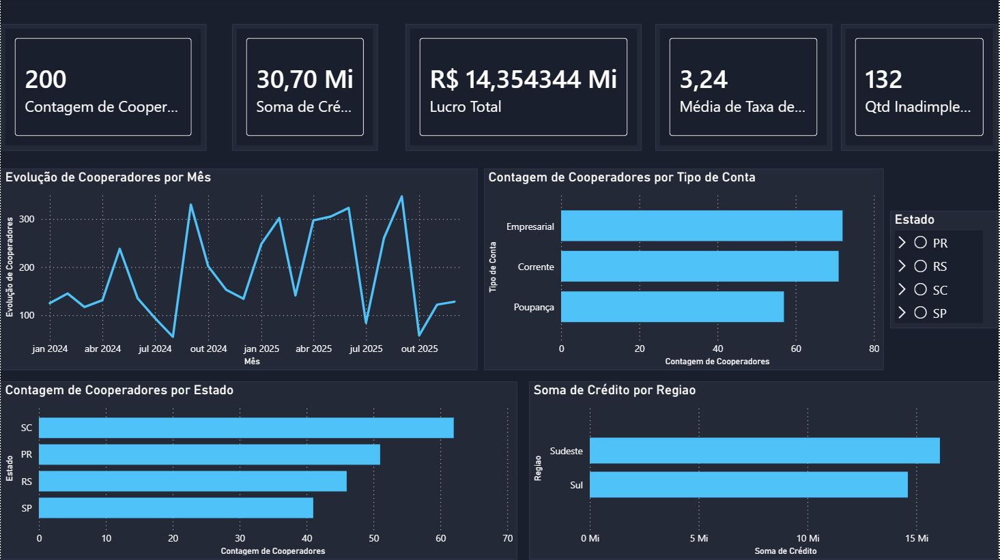
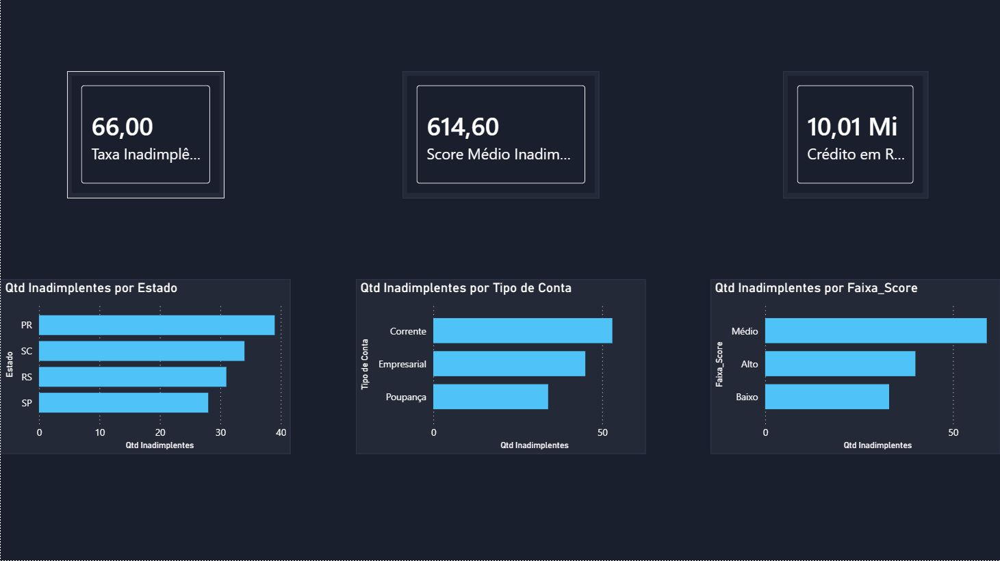

# Dashboard de Análise de Cooperados — Transpocred

Dashboard desenvolvido no Power BI para análise de cooperados, crédito e inadimplência de uma cooperativa financeira fictícia.

## Visão Geral

O projeto simula um cenário real de uma cooperativa de crédito com 200 cooperados distribuídos nos estados de SC, PR, RS e SP. O objetivo foi transformar dados brutos em uma visão gerencial clara, com foco em dois temas: **perfil dos cooperados** e **análise de risco de inadimplência**.

## Páginas do Dashboard

### Página 1 — Visão Geral

Indicadores gerais da cooperativa:
- Total de cooperadores, soma de crédito, lucro total, taxa de juros e quantidade de inadimplentes
- Evolução de cooperadores ao longo do tempo
- Distribuição por tipo de conta (Empresarial, Corrente, Poupança)
- Distribuição por estado e por região

### Página 2 — Análise de Inadimplência

Foco em risco de crédito:
- **66%** de taxa de inadimplência — alto índice que sinaliza necessidade de revisão de critérios de concessão
- **Score médio de 614** entre os inadimplentes — perfil de risco médio
- **R$ 10,01 Mi** em crédito em risco
- Inadimplência concentrada no PR e no tipo de conta Corrente
- Faixa de score Médio lidera em volume de inadimplentes

## Transformações Realizadas

- Criação da coluna **Mês/Ano** a partir da data de entrada para análise temporal
- Criação da coluna **Faixa_Score** categorizando o score em Baixo, Médio e Alto
- Criação de medidas DAX: Taxa de Inadimplência, Score Médio dos Inadimplentes, Crédito em Risco

## Ferramentas

- Power BI Desktop
- Excel (base de dados)
- DAX (medidas calculadas)

## Autor

**Arthur Rian Casagrande**  
[LinkedIn](https://linkedin.com/in/arthur-rian-casagrande-b22b71289/) • [GitHub](https://github.com/arthurrc02)
